# Lectura de archivo de 10 millones de plabras

### Presentado por:

Jeisson G. Sanchez R.

### Docker Hub 

[ver](https://hub.docker.com/repository/docker/jsanchez0/service-complex)

### Instalacion del servicio de docker

~~~
    sudo yum install docker
~~~

### Nota:

Los pasos que no se especifican se pueden omitir dando en el boton siguiente en la configuracion.

### Abrimos el archivo Crontab

~~~
    crontab -e
~~~

### Editamos el archivo crontab y ponemos lo siguiente

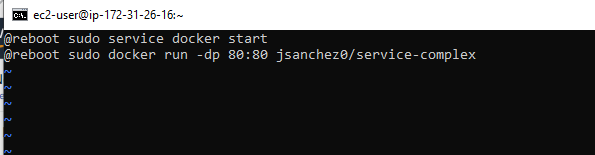

### Prueba en el browser

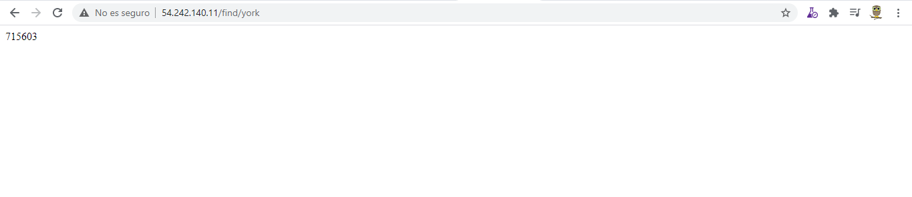

### Creamos una imagen de la maquina virtual actual

Seleccionamos la maquina virtual sobre la cual realizamos la configuracion

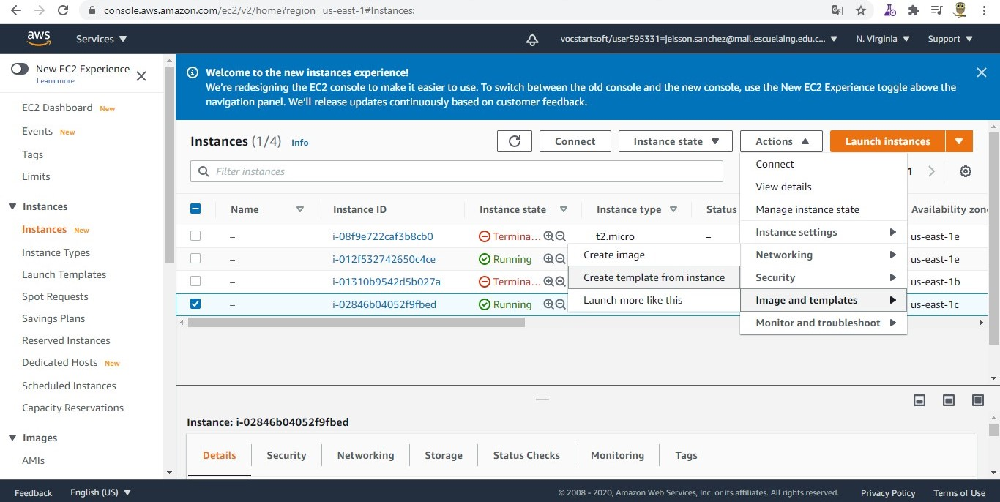

Luego ponemos el nombre de la imagen y esperemos a que sea creada.

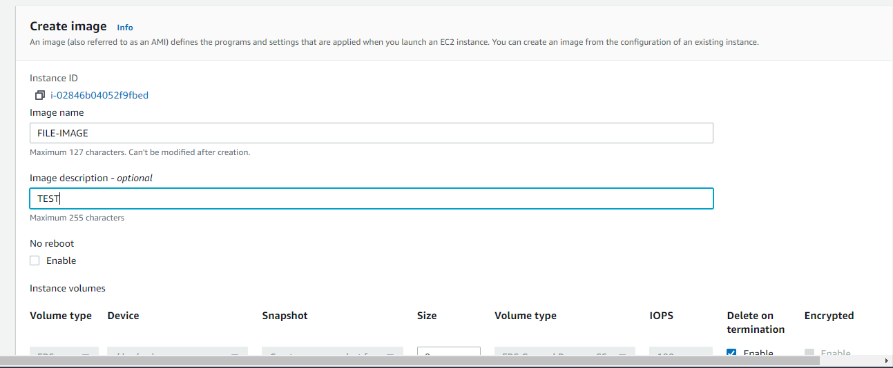

Ahora creamos una maquina virtual con nuestra imagen.

### Creacion de Template

Seleccionamos la maquina sobre la cual queremos crear el template para depliegue

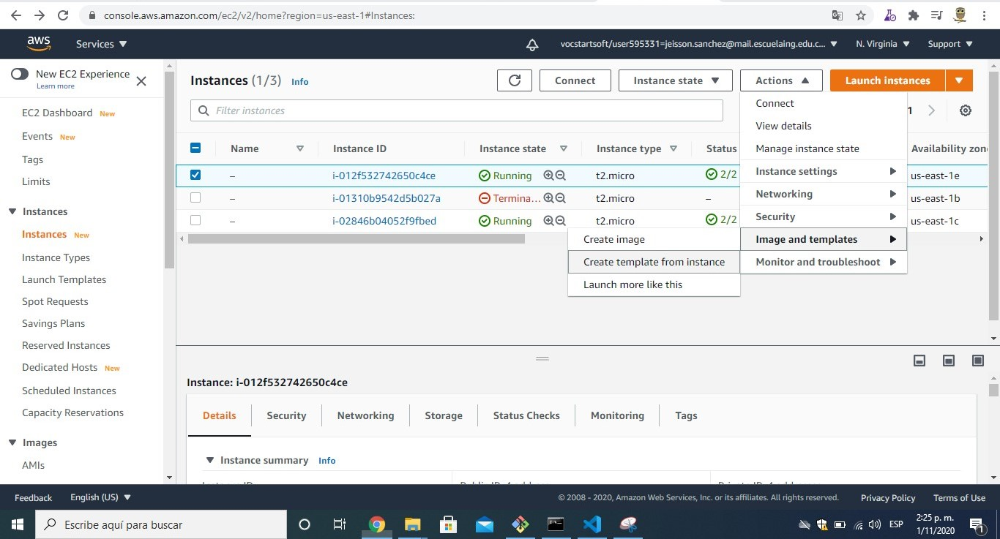

Llenamos el nombre, la descripcion del template, y que nos ayude con la creacion del grupo de auto escalado.

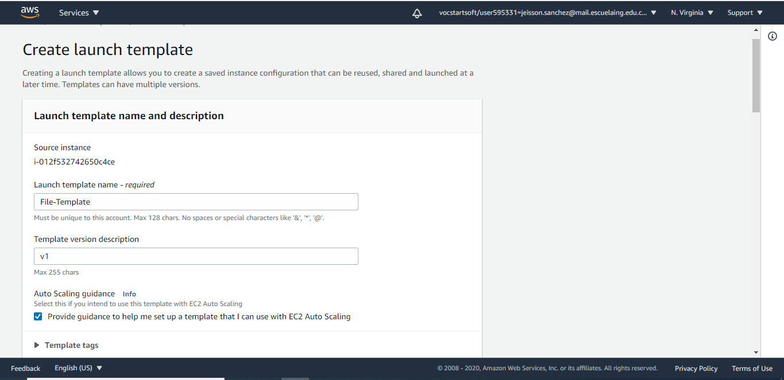

Seleccionamos VPC para nuestra networking

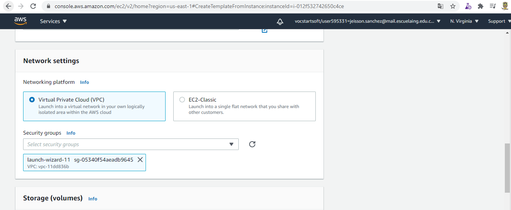

Modificamos en opciones avanzadas los sisguientes items

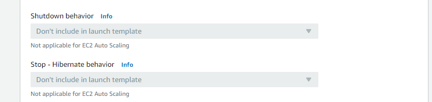

Ingresamos a nuestro Template y en el item acciones seleccionamos crear instancia para template

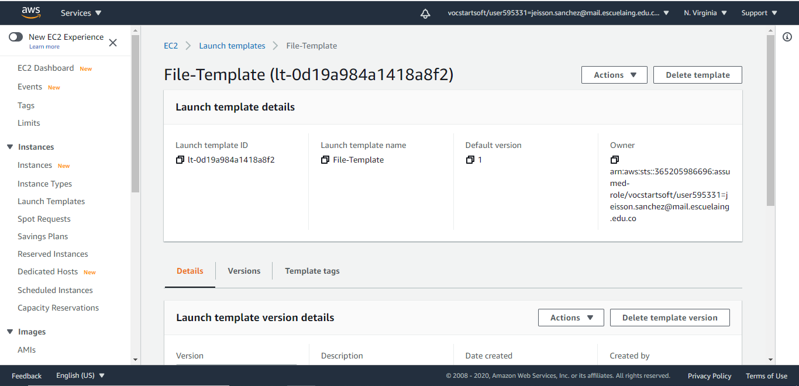

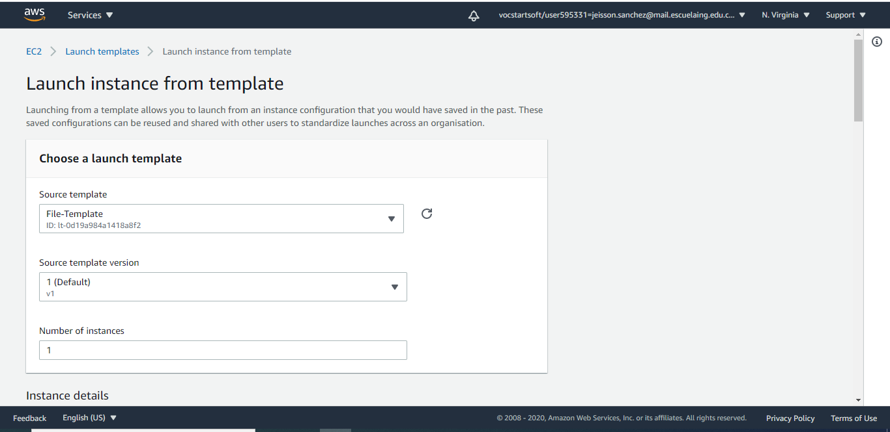

Vamos a la instancia

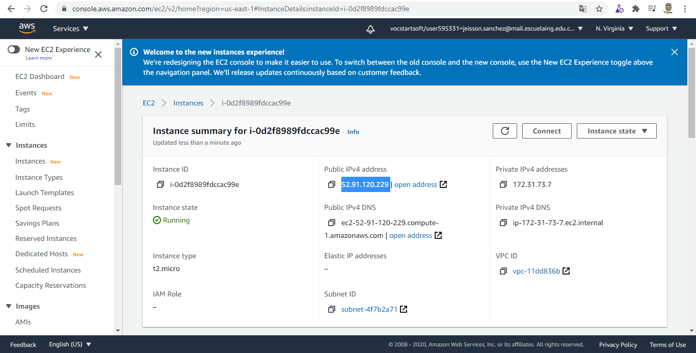

Vamos a probar que nuestra instancia funcione

### Creacion de un balanceador de carga

Vamos a la seccion balanceadores de carga y damos clic en el boton crear

Seleccionamos http/https

Ingresamos el nombre del balanceador de carga

Seleccionamos las zonas de disponibilidad

En configure Routing ingresamos el nombre

En la seccion review damos clic sobre crear

### Creacion de Grupo de Auto Escalamiento

Ingresamos los datos del Template en que Se desea crear unicamente modificamos el template, y las subredes, en los demas se puede saltar.

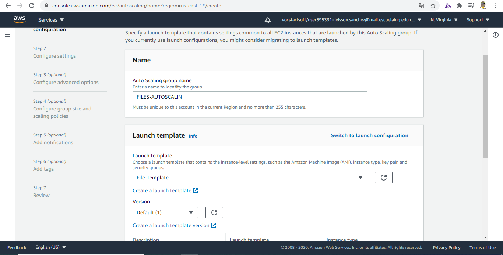

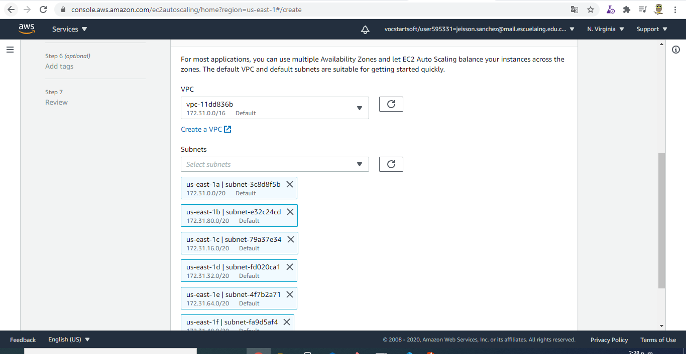

### Ahora sobre la Marcha vamos a modificarlo

Seleccionamos el numero de  instancias minimo y maximo (Inicio del grupo de escalamiento)

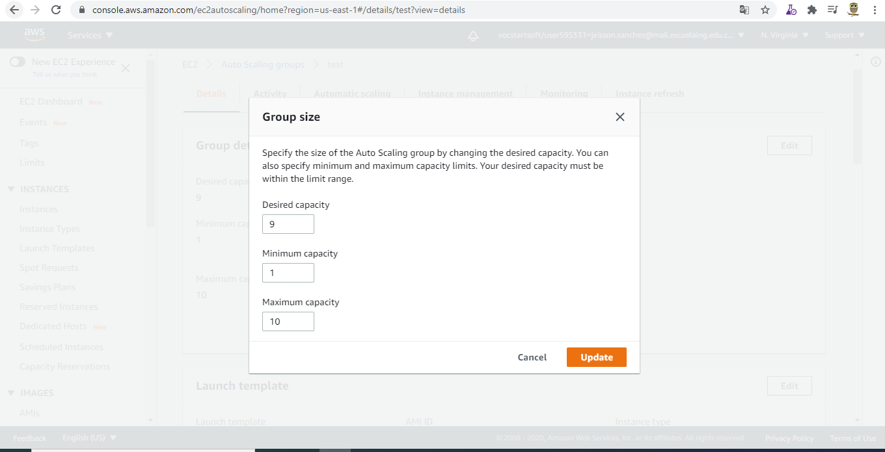

Por facilidad utilizamos un balanceador de carga (Inicio del grupo de escalamiento)

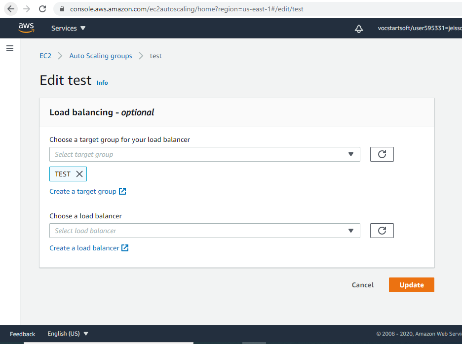

Ahora vamos a la seccion autoscaling de nuestro grupo y definimos una regla de escalamiento

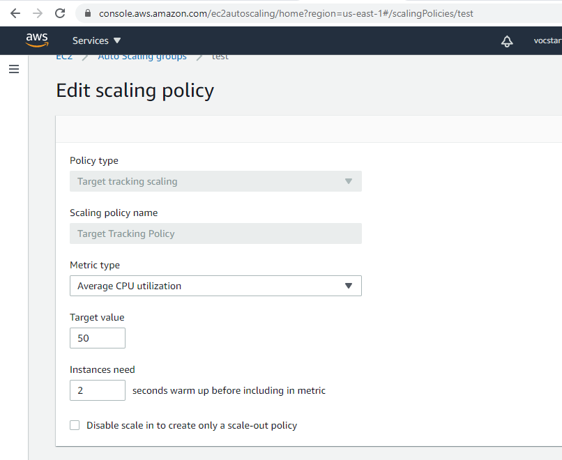

### Video evidencia de auto escalado

[Ver](https://www.youtube.com/watch?v=hua5Cfj6vzE&feature=youtu.be)