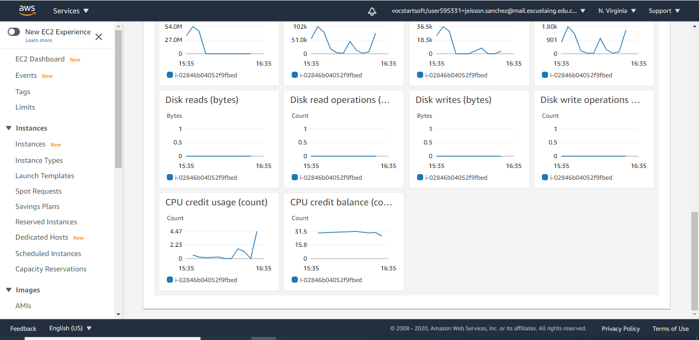

# Lectura de archivo de 10 millones de plabras

### Presentado por:

Jeisson G. Sanchez R.

### Docker Hub 

[ver](https://hub.docker.com/repository/docker/jsanchez0/service-complex)

### Instalacion del servicio de docker

~~~
    sudo yum install docker
~~~

### Abrimos el archivo Crontab

~~~
    crontab -e
~~~

### Editamos el archivo crontab y ponemos lo siguiente

### Algunas pruebas

**Broser Test**

**Pruebas de carga usando JMETER**

1. Creacion de un grupo de hilos para peticiones

En esta imagen podemos ver que en cada iteracion envia 100 peticiones, en 30 iteraciones, por lo tanto tenemos un total de 3000 usuarios por el total de la prueba.

2. Creamos la peticion http

Le estamos diciendo al programa que le solicite a nuestro programa que consulte cuantas oaciones aparece la palabra "york".

3. Creamos un listener para este ejemplo un "result view tree"

4. Corremos las pruebas y esperamos se sature la memoria o la cpu

### Creamos una imagen de la maquina virtual actual

Seleccionamos la maquina virtual sobre la cual realizamos la configuracion

Luego ponemos el nombre de la imagen y esperemos a que sea creada.

Ahora creamos una maquina virtual con nuestra imagen.

### Creacion de Template

Seleccionamos la maquina sobre la cual queremos crear el template para depliegue

Llenamos el nombre, la descripcion del template, y que nos ayude con la creacion del grupo de auto escalado.

Seleccionamos VPC para nuestra networking

Modificamos en opciones avanzadas los sisguientes items

Ingresamos a nuestro Template y en el item acciones seleccionamos crear instancia para template

Vamos a la instancia

Vamos a probar que nuestra instancia funcione

### Creacion de Grupo de Auto Escalamiento

Ingresamos los datos del Template en que Se desea crear unicamente modificamos el template, y las subredes, en los demas se puede saltar.

### Ahora sobre la Marcha vamos a modificarlo

Seleccionamos el numero de  instancias minimo y maximo (Inicio del grupo de escalamiento)

Por facilidad utilizamos un balanceador de carga (Inicio del grupo de escalamiento)

Ahora vamos a la seccion autoscaling de nuestro grupo y definimos una regla de escalamiento

### Video evidencia de auto escalado

[Ver](https://www.youtube.com/watch?v=hua5Cfj6vzE&feature=youtu.be)